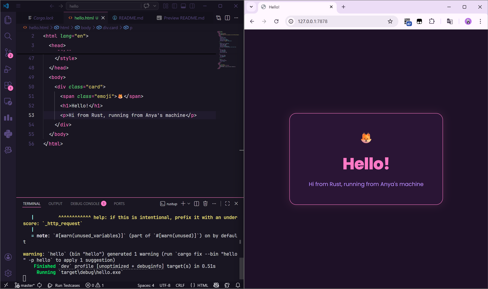
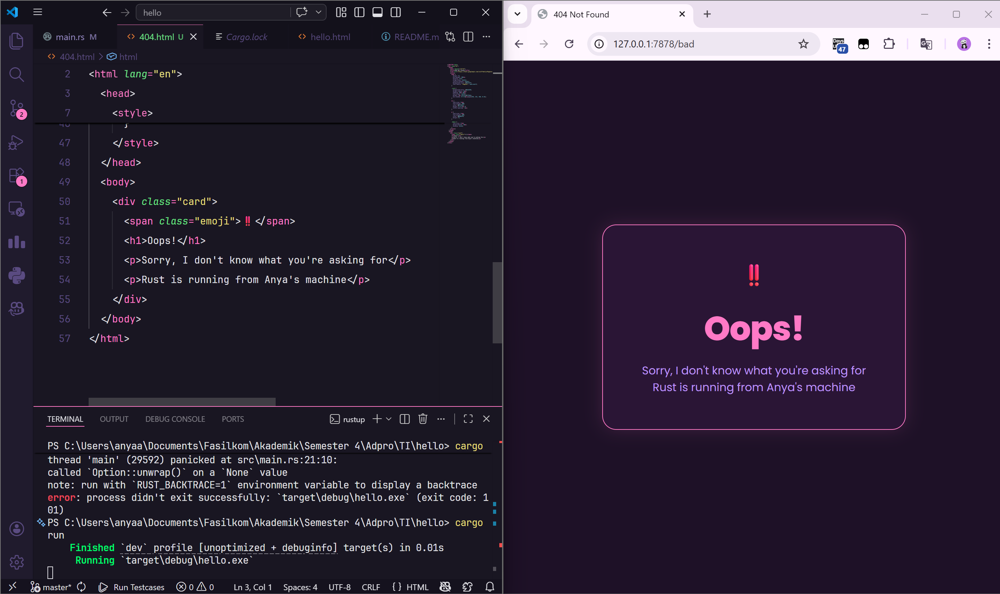

# Reflection

Anya Aleena Wardhany

2406401773

<b>Milestone 1</b>

Pada milestone ini, saya membuat single-threaded web server sederhana menggunakan Rust yang mendengarkan koneksi TCP pada alamat `127.0.0.1:7878`

Fungsi `handle_connection` menerima parameter `TcpStream` yang merepresentasikan koneksi aktif antara server dan browser. Di dalamnya, `BufReader` digunakan untuk membungkus stream agar bisa dibaca baris per baris secara efisien.

HTTP request dari browser dibaca menggunakan `.lines()`, kemudian di-map untuk unwrap setiap `Result`, dan dikumpulkan sampai bertemu baris kosong menggunakan `.take_while(|line| !line.is_empty())` yang menandakan akhir dari HTTP header. Hasilnya dikumpulkan ke dalam `Vec<String>` lalu dicetak ke konsol.

Dari output yang muncul di konsol, saya dapat melihat struktur HTTP request yang dikirim browser, seperti:
- Method (`GET`)
- Path (`/`)
- Versi protokol (`HTTP/1.1`)
- Berbagai header seperti `Host`, `User-Agent`, `Accept`, dan `Connection`

Hal ini membantu saya memahami bagaimana komunikasi antara browser dan server bekerja pada level protokol HTTP yang sebenarnya.

<b>Milestone 2</b>

**Screenshot hasil:**

Pada milestone ini, saya memodifikasi fungsi `handle_connection` agar server tidak hanya mencetak request ke konsol, tetapi juga mengirimkan HTTP response yang bisa dirender oleh browser.

Perubahan utama yang dilakukan adalah menambahkan `fs` ke dalam import dan menyusun HTTP response string yang valid. `fs::read_to_string("hello.html")` digunakan untuk membaca seluruh isi file HTML menjadi sebuah `String`. Response kemudian dibentuk menggunakan `format!()` dengan beberapa bagian yang dipisahkan oleh `\r\n` sesuai protokol HTTP/1.1:

- **Status line**: `HTTP/1.1 200 OK` memberi tahu browser bahwa request berhasil diproses.
- **Header**: `Content-Length: {length}` memberi tahu browser berapa byte yang akan diterima,
  sehingga browser tahu kapan response berakhir.
- **Blank line**: Urutan `\r\n\r\n` memisahkan header dari body, ini adalah syarat wajib
  dalam spesifikasi HTTP.
- **Body**: Isi konten HTML yang dibaca dari file `hello.html`.

`stream.write_all(response.as_bytes())` mengonversi response string menjadi raw bytes dan menulisnya ke TCP stream, yang kemudian diterima dan dirender oleh browser.

Yang menarik adalah server kita tidak perlu mengerti CSS, JavaScript, maupun font sama sekali. Server hanya bertugas mengirimkan file HTML mentah, dan browser yang mengurus semua proses parsing dan eksekusinya, termasuk mengambil Google Fonts dari URL eksternal.
Ini menunjukkan pemisahan tanggung jawab yang jelas antara server (mengirim konten) dan browser (merender dan mengeksekusi konten tersebut).

<b>Milestone 3</b>

**Screenshot hasil:**

Pada milestone ini, saya memodifikasi fungsi `handle_connection` agar server bisa
membedakan request yang valid dan tidak valid, lalu merespons dengan halaman yang sesuai.

Perubahan utama adalah cara membaca request. Sebelumnya semua baris header dikumpulkan
ke dalam `Vec`, sekarang kita hanya mengambil baris pertama saja menggunakan `.next()`
karena baris pertama HTTP request sudah cukup untuk menentukan halaman mana yang diminta,
contohnya `GET / HTTP/1.1`.

Dari request line tersebut, server menentukan response yang tepat menggunakan `if-else`:

- Jika request line adalah `GET / HTTP/1.1`, server mengembalikan `hello.html`
  dengan status `HTTP/1.1 200 OK`.
- Untuk request lainnya, server mengembalikan `404.html` dengan status
  `HTTP/1.1 404 NOT FOUND`.

Pemisahan antara `status_line` dan `filename` ke dalam tuple membuat kode lebih rapi
karena logika pembentukan response di bagian bawah tidak perlu diulang untuk setiap kondisi.
Ini adalah bentuk refactoring sederhana yang menghindari duplikasi kode.

<b>Milestone 4</b>

Pada milestone ini, saya menambahkan simulasi slow response untuk memperlihatkan
kelemahan dari single-threaded server.

Perubahan utama adalah mengganti `if-else` menjadi `match` dan menambahkan endpoint
baru `/sleep`. Ketika browser mengakses `/sleep`, server akan berhenti selama 10 detik
menggunakan `thread::sleep(Duration::from_secs(10))` sebelum mengirimkan response.

Ketika saya membuka dua tab browser secara bersamaan, tab pertama mengakses `/sleep`
dan tab kedua mengakses `/`, tab kedua ikut tertahan dan baru mendapat response setelah
tab pertama selesai. Ini terjadi karena server hanya punya satu thread, sehingga setiap
request harus antri dan diproses satu per satu secara berurutan.

Hal ini menunjukkan bahwa single-threaded server sangat tidak efisien untuk menangani
banyak request sekaligus. Jika ada satu request yang lambat, semua request lain ikut
terhambat. Inilah motivasi utama untuk beralih ke multithreaded server di milestone
berikutnya.

